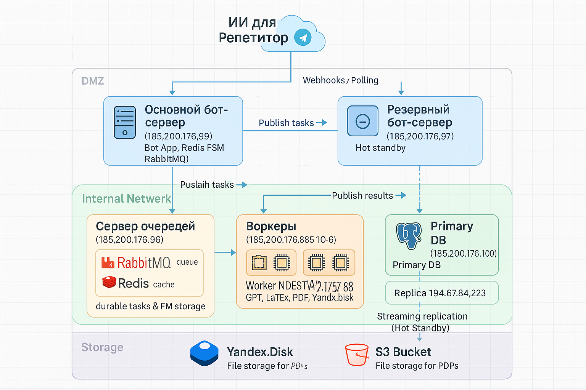

# RiverAI 🤖

**ИИ-Ассистент для Репетитора в Telegram**

Проект предназначен для автоматизации рутинных задач репетиторов: ведения базы учеников, генерации учебных материалов с помощью ИИ, проверки домашних работ и общения с GPT в контексте ученика.

---

## 🎯 Цель и аудитория

* **Цель:** предоставить преподавателю инструмент, экономящий время на подготовку материалов и анализ домашних работ. Бот позволяет быстро создавать индивидуальные учебные планы и задания, получать проверку решений с пояснениями и вести диалог с ИИ.
* **Аудитория:** частные репетиторы и небольшие учебные центры, стремящиеся стандартизировать и упростить подготовку к занятиям.

---

## ✨ Основные возможности

1. **Управление учениками**

   * Добавление, редактирование и удаление профилей (имя, предмет, уровень, заметки).
2. **Генерация учебного плана**

   * По описанию темы формируется подробный план.
   * Возможность сохранить результат в текстовом или PDF формате на Яндекс.Диске.
3. **Генерация заданий**

   * Создание набора упражнений по теме.
   * Генерация решений в PDF и отправка ученику.
4. **Проверка домашнего задания**

   * Анализ загруженного файла с решением ученика через GPT.
   * Отчёт с ошибками, правильными ответами и рекомендациями.
   * Сохранение отчёта на Я.Диске.
5. **Персональный чат с GPT**

   * Диалог от лица ученика или с учётом его уровня.
   * Хранение истории последних 10 сообщений для контекста.
6. **Подписки и лимиты**

   * Базовый тариф: \~200 ИИ-запросов/мес.
   * Премиум: \~1000 или без ограничений.
   * Отображение оставшегося лимита и история платежей.
7. **Настройки и безопасность**

   * Смена имени профиля, установка пароля (bcrypt), язык интерфейса (RU/EN).
   * Привязка Яндекс.Диска, уведомления об окончании подписки и готовности отчётов.

---

## 🏗️ Архитектура системы



**Компоненты:**

* **Bot Application** (Python, Aiogram 3)

  * Принимает обновления от Telegram (webhook/polling).
  * Публикует задачи в RabbitMQ, сохраняет состояние FSM в Redis.
* **Queue & State**

  * **RabbitMQ:** task\_queue и result\_queue.
  * **Redis:** хранение FSM и контекста диалога.
* **Workers** (Python, asyncio)

  * Слушают task\_queue, обрабатывают задачи (OpenAI API, LaTeX, загрузка на облако).
  * Отправляют результаты в result\_queue.
* **База данных** (PostgreSQL)

  * Основная и реплика (Hot Standby).
  * Хранение профилей, статистики, подписок и логов.

**Отказоустойчивость и масштабирование:**

* Резервный бот-приложение в другом датацентре.
* Репликация БД и возможность promote резервной в мастер.
* Избыточность воркеров и зеркалирование RabbitMQ.

---

## 🚀 Развёртывание и запуск

### 1. Клонирование репозитория

```bash
git clone https://github.com/your-repo/RiverAI.git
cd RiverAI
```

### 2. Настройка переменных окружения

* Создайте файл `.env` по шаблону.
* Заполните: `TELEGRAM_TOKEN`, `DB_HOST`, `RABBITMQ_HOST`, `REDIS_HOST`, `OPENAI_KEYS` и др.

### 3. Запуск инфраструктуры очередей

```bash
cd infrastructure/queue/
./deploy.sh
```

### 4. Запуск PostgreSQL (Primary)

```bash
docker run -d --name postgres-main \
  -e POSTGRES_DB=tutorbot_db -e POSTGRES_USER=tutorbot -e POSTGRES_PASSWORD=... \
  -p 5432:5432 postgres:14
```

### 5. Запуск PostgreSQL (Replica)

Настройте streaming replication или используйте Docker Bitnami образ.

### 6. Запуск бота

```bash
cd infrastructure/bot/
./deploy.sh
```

### 7. Запуск воркеров

```bash
cd infrastructure/worker1-2/
./deploy.sh
# И аналогично на других серверах
```

### 8. Telegram Webhook

* Настройте через BotFather или API Telegram.

### 9. Тестирование

* Отправьте `/start` в боте.
* Добавьте ученика и проверьте генерацию плана.

---

## 🔐 Безопасность

* **Шифрование данных** (AES-256 EAX): чувствительные поля и OAuth-токены.
* **Хэширование паролей** (bcrypt).
* **Аутентификация** по Telegram ID без отдельной регистрации.
* **Изоляция секретов**: все ключи в `.env`, минимальные права доступа.
* **Контейнеризация Docker**: приватные сети, открыты только нужные порты.

---

