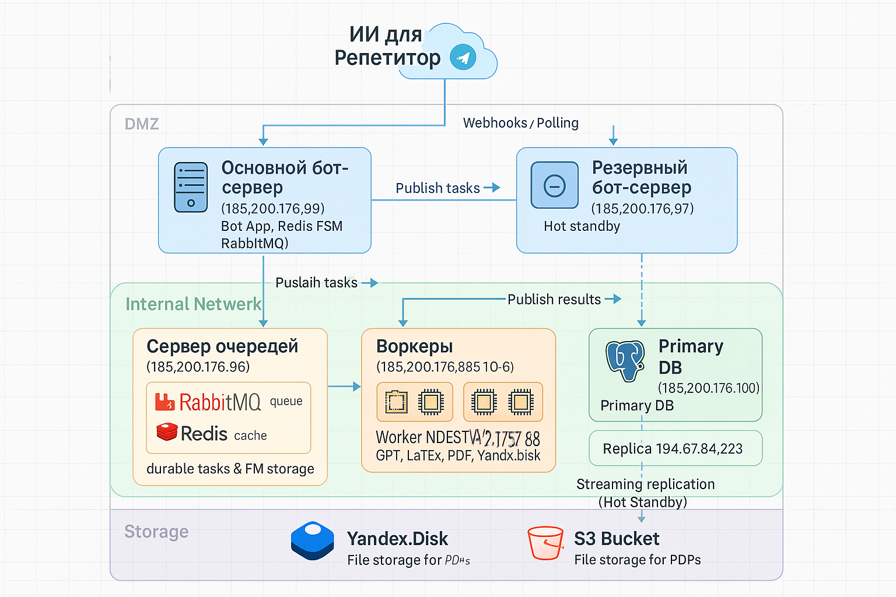
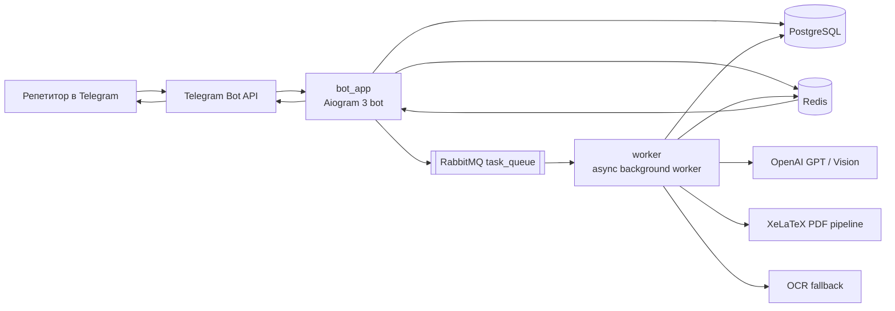
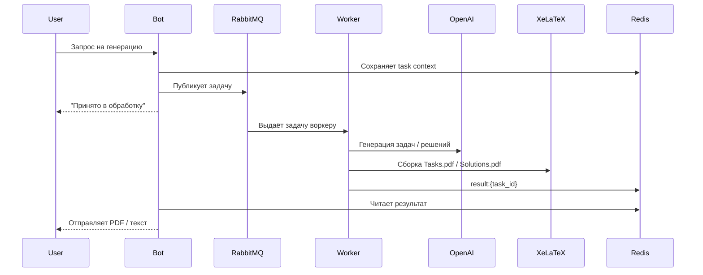

# RiverAI

> **Telegram-платформа для репетиторов с ИИ-генерацией, OCR, PDF-отчётами, очередями задач и распределённой архитектурой.**

<p align="center">
  
  
  
  
  
  
  
</p>

---

## Содержание

- [Что такое RiverAI](#что-такое-riverai)
- [Для кого этот проект](#для-кого-этот-проект)
- [Что умеет система](#что-умеет-система)
- [Как выглядит пользовательский сценарий](#как-выглядит-пользовательский-сценарий)
- [Архитектура](#архитектура)
- [Почему архитектура именно такая](#почему-архитектура-именно-такая)
- [Как проходит запрос внутри системы](#как-проходит-запрос-внутри-системы)
- [Структура репозитория](#структура-репозитория)
- [Ключевые модули и ответственность кода](#ключевые-модули-и-ответственность-кода)
- [Технологический стек](#технологический-стек)
- [Данные, очереди и контекст](#данные-очереди-и-контекст)
- [PDF, OCR и генерация контента](#pdf-ocr-и-генерация-контента)
- [Платежи и подписки](#платежи-и-подписки)
- [Безопасность и приватность](#безопасность-и-приватность)
- [Запуск проекта](#запуск-проекта)
- [Запуск в распределённом режиме](#запуск-в-распределённом-режиме)
- [Переменные окружения](#переменные-окружения)
- [Как разрабатывать и расширять RiverAI](#как-разрабатывать-и-расширять-riverai)
- [Почему этот репозиторий устроен именно так](#почему-этот-репозиторий-устроен-именно-так)
- [Планы развития](#планы-развития)

---

## Что такое RiverAI

**RiverAI** — это инженерный Telegram-проект для репетиторов, который автоматизирует самые дорогие по времени задачи:

- ведение профилей учеников;
- генерацию учебных планов и комплектов заданий;
- подготовку PDF-файлов для ученика и преподавателя;
- OCR-распознавание фотографий и PDF;
- проверку домашней работы с помощью GPT;
- контекстный чат по конкретному ученику;
- хранение истории, лимитов и подписок;
- асинхронную обработку тяжёлых задач через очередь.

Это не просто «бот с одним prompt». RiverAI — это **связка интерфейса, очередей, воркеров, БД, кеша, OCR, PDF-пайплайна и платежной логики**, собранная в единый продукт.

---

## Для кого этот проект

RiverAI создавался для сценария, где у преподавателя много рутинной методической работы:

- нужно быстро подбирать задания под уровень конкретного ученика;
- нужно собирать материалы в понятный PDF, а не в сырой текст;
- нужно проверять домашние работы и возвращать структурированную обратную связь;
- нужно уметь вести диалог не «вообще», а в контексте конкретного ученика;
- нужно масштабировать обработку без зависания Telegram-бота.

Главная идея проекта: **бот должен оставаться быстрым и отзывчивым, а всё тяжёлое должно уезжать в фоновые сервисы**.

---

## Что умеет система

### 1. Работа с учениками

- создание и хранение карточек учеников;
- редактирование имени, предмета, уровня и заметок;
- удаление ученика;
- вход в отдельный контекст чата по конкретному ученику.

### 2. Генерация учебного плана

- преподаватель выбирает ученика;
- бот запрашивает описание;
- задача ставится в очередь;
- воркер вызывает GPT;
- результат может быть возвращён как текст и/или собран в PDF.

### 3. Генерация заданий

- формирование списка задач под тему, формат и уровень;
- отдельный выход для ученика и преподавателя;
- в текущем пайплайне воркер собирает **два файла**:
  - `Tasks.pdf` — только задачи;
  - `Solutions.pdf` — задачи + решения.

### 4. OCR + генерация

- пользователь может отправить файл, фотографию или PDF;
- воркер извлекает текст через OCR;
- распознанный текст становится основой для следующего шага генерации.

### 5. Проверка домашней работы

- загрузка решения;
- OCR/извлечение текста;
- проверка с помощью GPT;
- сборка отчёта в PDF;
- возврат результата в Telegram.

### 6. Контекстный чат с GPT

- чат идёт не в вакууме, а в контексте ученика;
- история сообщений хранится в Redis;
- есть отдельное завершение и очистка диалога.

### 7. Подписки и платежи

- базовые и расширенные тарифы;
- учёт usage;
- webhook-обработка платежей;
- автоматическая активация тарифа после подтверждённой оплаты.

### 8. Асинхронная архитектура

- бот не ждёт, пока GPT отработает;
- тяжёлые действия уходят в очередь;
- воркер обрабатывает задачу независимо;
- результат возвращается позже через отдельный канал доставки.

---

## Как выглядит пользовательский сценарий

### Базовый UX-цикл

1. Репетитор открывает бота.
2. Выбирает ученика.
3. Запускает одно из действий:
   - генерация учебного плана;
   - генерация заданий;
   - проверка ДЗ;
   - чат с GPT.
4. Бот принимает ввод и **не блокируется**.
5. Тяжёлая задача уходит в фон.
6. По завершении пользователь получает текст, PDF или оба результата.
7. При необходимости запускает цикл **«исправить / уточнить / пересобрать»**.

### Важный продуктовый принцип

RiverAI строился вокруг сценария:

> **запрос → результат → правки → повторная генерация**

То есть система не ограничивается одноразовой генерацией. Она поддерживает итеративную работу преподавателя с материалом.

---

## Архитектура

### Схема высокого уровня

<p align="center">
  
</p>

### Mermaid-диаграмма


```mermaid
flowchart LR
    U[Репетитор в Telegram] --> T[Telegram Bot API]
    T --> B[bot_app\nAiogram 3 bot]
    B --> PG[(PostgreSQL)]
    B --> R[(Redis)]
    B --> MQ[[RabbitMQ task_queue]]

    MQ --> W[worker\nasync background worker]
    W --> OAI[OpenAI GPT / Vision]
    W --> TEX[XeLaTeX PDF pipeline]
    W --> OCR[OCR fallback]
    W --> PG
    W --> R

    R --> B
    B --> T
    T --> U
```

### Главные компоненты

#### `bot_app`
Слой Telegram-интерфейса:

- принимает сообщения и callback'и;
- ведёт FSM-состояния;
- валидирует пользовательский ввод;
- читает и пишет данные в PostgreSQL;
- публикует тяжёлые задачи в очередь;
- принимает готовые результаты и доставляет их пользователю.

#### `worker`
Слой тяжёлой бизнес-логики:

- генерация заданий и решений;
- проверка ДЗ;
- OCR;
- сборка LaTeX/XeLaTeX PDF;
- вызовы OpenAI;
- обработка чатов;
- упаковка результата и возврат его по `task_id`.

#### `RabbitMQ`
Транспорт фоновых задач:

- разгружает Telegram-бота;
- позволяет масштабировать обработку через дополнительные воркеры;
- изолирует интерфейс от долгих операций;
- повышает устойчивость обработки.

#### `Redis`
Оперативный слой:

- FSM состояния;
- контекст задач по `task_id`;
- история чатов;
- временные результаты;
- резервный/альтернативный канал доставки результата.

#### `PostgreSQL`
Основное постоянное хранилище:

- пользователи;
- ученики;
- usage и лимиты;
- подписки;
- токены и интеграции;
- история работы системы.

---

## Почему архитектура именно такая

В ходе развития проекта стало понятно, что монолитный Telegram-бот быстро упирается в ограничения:

- GPT отвечает не мгновенно;
- OCR и PDF-компиляция занимают заметное время;
- при прямой синхронной обработке бот начинает «висеть»;
- при росте нагрузки нужно уметь масштабировать тяжёлую часть отдельно от интерфейса.

Поэтому проект эволюционировал в сторону **разделения ролей**:

- **бот** отвечает за UX и маршрутизацию;
- **воркер** отвечает за AI/OCR/PDF;
- **RabbitMQ** отвечает за передачу задач;
- **Redis** отвечает за оперативный контекст и быстрый обмен;
- **PostgreSQL** отвечает за постоянные данные.

Отдельно важно и то, что в проекте принималось решение **не тянуть лишние персональные данные в тяжелый контур обработки**. Для этого асинхронные процессы привязаны к `task_id`, а пользовательский контекст восстанавливается через Redis и БД.

---

## Как проходит запрос внутри системы

### Сценарий: генерация заданий


```mermaid
sequenceDiagram
    participant U as User
    participant B as Bot
    participant MQ as RabbitMQ
    participant W as Worker
    participant G as OpenAI
    participant X as XeLaTeX
    participant R as Redis

    U->>B: Запрос на генерацию
    B->>R: Сохраняет task context
    B->>MQ: Публикует задачу
    B-->>U: "Принято в обработку"
    MQ->>W: Выдаёт задачу воркеру
    W->>G: Генерация задач / решений
    W->>X: Сборка Tasks.pdf / Solutions.pdf
    W->>R: result:{task_id}
    B->>R: Читает результат
    B-->>U: Отправляет PDF / текст
```

### Сценарий: проверка домашней работы

1. Бот получает файл.
2. Формирует задачу и передаёт её в фоновую обработку.
3. Воркер извлекает текст:
   - через OpenAI Vision OCR;
   - при необходимости через fallback OCR.
4. Далее запускается проверка через GPT.
5. Ответ нормализуется под LaTeX.
6. Из него собирается PDF-отчёт.
7. Результат кладётся в Redis/очередь результатов.
8. Бот отправляет итог пользователю.

### Сценарий: чат

1. Бот создаёт задачу `chat`.
2. Воркер поднимает историю диалога из Redis.
3. Вызов GPT выполняется на быстрой модели.
4. Ответ сохраняется обратно в историю.
5. Бот доставляет текст в Telegram.

---

## Структура репозитория

Ниже — структура, отражающая текущую организацию проекта в репозитории:

```text
RiverAI/
├── .github/workflows/               # CI/CD и автоматизация
├── bot_app/                         # Telegram-бот, роутеры, middleware, webhook'и
├── common/                          # Общие утилиты, Redis helpers, shared logic
├── db_server/                       # Конфиги / утилиты для серверной БД
├── infrastructure/                  # Docker Compose для bot / worker / queue
├── queue_server/                    # Компоненты очередного сервера
├── scripts/                         # Скрипты развёртывания и обслуживания
├── ssh_config_template/             # Шаблоны для SSH-доступа и инфраструктуры
├── templates/                       # Шаблоны документов и вспомогательные шаблоны
├── worker/                          # Воркеры, сервисы AI/OCR/PDF/Chat
├── Dockerfile.bot                   # Образ Telegram-бота
├── Dockerfile.worker                # Образ воркера с TeXLive и OCR
├── DISTRIBUTED_SETUP_INSTRUCTIONS.md
├── RESTORE_INSTRUCTIONS.md
├── SERVER_FIX_INSTRUCTIONS.md
├── architecture.png
├── broker.py
├── pyproject.toml
└── requirements.txt
```

---

## Ключевые модули и ответственность кода

### Бот

| Модуль | Что делает |
|---|---|
| `bot_app/main.py` | Точка входа бота: инициализация Redis, PostgreSQL, Aiogram, RabbitMQ, webhook'а оплаты и consumer'ов результата |
| `bot_app/handlers/*` | Разделённые роутеры по продуктовым сценариям: start, students, generation, chatgpt, homework_check, subscription, settings, payment и др. |
| `bot_app/result_consumer.py` | Запускает два контура приёма результата: AMQP consumer и Redis poller |
| `bot_app/webhooks/payment_webhook_aiohttp.py` | Обрабатывает webhook платежной системы и активирует подписку |
| `bot_app/middlewares/*` | Авторизация и служебная логика на уровне запросов |

### Воркеры

| Модуль | Что делает |
|---|---|
| `worker/main.py` | Инициализация Redis, PostgreSQL, RabbitMQ; запуск вечного consumer'а задач |
| `worker/consumers/task_consumer.py` | Центральный маршрутизатор типов задач |
| `worker/services/tasks_service.py` | Генерация заданий и решений, сборка `Tasks.pdf` и `Solutions.pdf` |
| `worker/services/homework_check_service.py` | Проверка домашней работы через GPT и сборка PDF-отчёта |
| `worker/services/ocr_service.py` | OCR-пайплайн: OpenAI Vision + fallback OCR |
| `worker/services/chat_service.py` | Контекстный чат с историей в Redis |
| `worker/services/pdf_utils.py` | Нормализация LaTeX и компиляция PDF |
| `worker/services/gpt_service.py` / `generation_service.py` | Низкоуровневые вызовы моделей и генерационных сценариев |

### Общие модули

| Модуль | Что делает |
|---|---|
| `common/redis_utils.py` | Контекст задач, история чата, last file storage, совместимость старых и новых ключей |
| `broker.py` | Вспомогательная брокерная логика проекта |
| `templates/` | Шаблоны, которые используются при формировании документов |

---

## Технологический стек

### Backend

- Python 3.10+
- Aiogram 3
- asyncio
- aiohttp
- aio-pika
- asyncpg
- Redis
- PostgreSQL

### AI / content generation

- OpenAI API
- GPT для генерации и проверки
- OpenAI Vision для OCR
- fallback OCR через Tesseract/Pillow/PyMuPDF

### PDF / documents

- Jinja2
- XeLaTeX / TeX Live
- генерация PDF из шаблонов и нормализованного LaTeX

### Infra / ops

- Docker
- Docker Compose
- RabbitMQ
- GitHub Actions (через `.github/workflows`)

### Payments / integrations

- YooKassa
- интеграционные ключи для облачного хранения и внешних сервисов

---

## Данные, очереди и контекст

### Почему здесь важен `task_id`

Одна из ключевых инженерных идей RiverAI — **отделить пользовательский Telegram-контекст от тяжёлой фоновой обработки**.

Поэтому жизненный цикл задачи построен так:

1. бот создаёт `task_id`;
2. сохраняет контекст задачи отдельно;
3. в очередь уходит не «весь пользовательский мир», а компактная задача;
4. воркер возвращает результат, привязанный к этому `task_id`;
5. бот восстанавливает, кому и что нужно отправить.

Это даёт несколько преимуществ:

- меньше связности между компонентами;
- лучше контроль приватности;
- удобнее повторная доставка результата;
- проще делать retries и наблюдать пайплайн.

### Что хранится в Redis

- FSM состояния;
- `task_context:{task_id}`;
- альтернативные legacy-ключи для обратной совместимости;
- `chat:{user_id}:{student_id}` — история диалога;
- временные файлы и служебные данные;
- ключи результатов вида `result:{task_id}`.

### Что хранится в PostgreSQL

- пользователи;
- ученики;
- usage;
- тарифы;
- токены;
- служебные записи и статистика.

---

## PDF, OCR и генерация контента

### Генерация заданий

В текущем сервисном слое генерация идёт в несколько шагов:

1. GPT генерирует список задач.
2. Отдельно генерируются решения.
3. Текст нормализуется под LaTeX.
4. Собираются два XeLaTeX-документа.
5. Оба компилируются в PDF.
6. Результат возвращается в base64/файловом виде дальше в систему доставки.

### Проверка ДЗ

Проверка строится так:

1. получить текст решения;
2. сформировать строгий system prompt для педагогической проверки;
3. получить структурированный ответ;
4. привести его к безопасному LaTeX;
5. собрать PDF-отчёт для преподавателя.

### OCR

OCR-пайплайн поддерживает:

- изображения;
- PDF (через рендер первой страницы в PNG);
- OpenAI Vision как основной движок;
- fallback через локальный OCR при необходимости.

### Почему используется XeLaTeX

Потому что проект работает с русскоязычными материалами, математикой и требованиями к аккуратной типографике. Для этого нужен стабильный рендер кириллицы, формул и длинных документов.

---

## Платежи и подписки

В проекте есть отдельный платёжный контур:

- webhook для платежной системы;
- обновление статуса платежа;
- автоматическая активация подписки;
- сброс usage при смене тарифа;
- уведомление пользователя в Telegram после успешной оплаты.

Отдельный сервис `payments-web` выделен в compose-конфигурации, чтобы платёжный контур не смешивался с основным runtime бота.

---

## Безопасность и приватность

RiverAI проектировался не как игрушка, а как система, где есть реальные пользовательские данные и платный функционал. Поэтому в репозиторий заложены следующие принципы:

### 1. Разделение контуров

- интерфейсный слой отдельно;
- тяжёлый AI-слой отдельно;
- БД отдельно;
- очередь отдельно.

### 2. Секреты не должны жить в коде

Все чувствительные значения должны задаваться через `.env` и переменные окружения.

### 3. Минимизация лишних данных в воркере

Тяжёлый контур работает через `task_id`, Redis и БД-контекст, а не через прямую жёсткую сцепку с Telegram-потоком.

### 4. Контролируемая доставка результата

Результат не «теряется в фоне»: для этого в проекте есть отдельные consumer'ы и резервный Redis-путь возврата.

### 5. Изоляция контейнеров

`Dockerfile.bot` и `Dockerfile.worker` разделяют зависимости бота и воркера. У воркера свой образ с LaTeX и OCR-инструментами.

---

## Запуск проекта

### 1. Клонирование

```bash
git clone https://github.com/max-hertz-coder/RiverAI.git
cd RiverAI
```

### 2. Подготовка окружения

Создайте `.env` на основе вашего шаблона и заполните секреты.

### 3. Создание общей Docker-сети

```bash
docker network create riverai-network
```

### 4. Запуск очередей

```bash
cd infrastructure/queue
docker compose up -d
```

### 5. Запуск воркера

```bash
cd ../worker
docker compose up -d
```

### 6. Запуск бота

```bash
cd ../bot
docker compose up -d
```

### 7. Проверка

```bash
docker ps
docker logs riverai-bot
docker logs riverai-worker
docker logs queue-rabbitmq
```

---

## Запуск в распределённом режиме

Для multi-server режима в репозитории уже есть отдельная инструкция:

- `DISTRIBUTED_SETUP_INSTRUCTIONS.md`

Типичный сценарий:

- **сервер очереди** — RabbitMQ + Redis;
- **сервер воркера** — heavy processing;
- **сервер бота** — Telegram runtime + webhook + consumers;
- **сервер БД** — PostgreSQL.

Это позволяет:

- изолировать нагрузку;
- масштабировать воркеры отдельно;
- упрощать отладку;
- безопаснее переживать пики и сбои.

---

## Переменные окружения

Ниже — не полный, но практический минимум по категориям.

### Telegram

```env
BOT_TOKEN=
```

### PostgreSQL

```env
WORKER_POSTGRES_DSN=
POSTGRES_HOST=
POSTGRES_PORT=5432
POSTGRES_DB=
POSTGRES_USER=
POSTGRES_PASSWORD=
```

### RabbitMQ

```env
RABBITMQ_HOST=
RABBITMQ_PORT=5672
RABBITMQ_USER=
RABBITMQ_PASS=
RABBITMQ_TASK_QUEUE=task_queue
RABBITMQ_RESULT_QUEUE=result_queue
```

### Redis

```env
REDIS_HOST=
REDIS_PORT=6379
REDIS_DB_CACHE=1
REDIS_DB_FSM=2
```

### OpenAI

```env
OPENAI_API_KEY=
OPENAI_API_KEYS=
```

### Payments

```env
PAYMENTS_PROVIDER=yookassa
PAYMENT_WEBHOOK_TOKEN=
PAYMENT_WEBHOOK_PORT=8080
YOOKASSA_SEND_RECEIPT=1
YOOKASSA_VAT_CODE=4
```

### Безопасность / интеграции

```env
TELEGRAM_ID_SALT=
WORKER_ENCRYPTION_SECRET=
YDKEY_V1=
YDKEY_VERSION=
```

> Точный набор переменных стоит сверять с `config.py`, `docker-compose.yml` и текущими compose-конфигурациями в `infrastructure/`.

---

## Как разрабатывать и расширять RiverAI

### Если вы хотите добавить новый тип задач

1. Добавьте новый тип в слой, который публикует задачу.
2. Передайте минимально достаточный payload.
3. Обработайте тип в `worker/consumers/task_consumer.py`.
4. Реализуйте отдельный сервис в `worker/services/...`.
5. Продумайте формат результата.
6. На стороне бота добавьте доставку этого типа результата пользователю.

### Если вы хотите улучшить генерацию

Наиболее логичные точки входа:

- `worker/services/generation_service.py`
- `worker/services/gpt_service.py`
- `worker/services/tasks_service.py`
- `worker/services/homework_check_service.py`

### Если вы хотите улучшить UX бота

Смотрите:

- `bot_app/handlers/*`
- `bot_app/middlewares/*`
- `bot_app/main.py`

### Если вы хотите улучшить доставку результатов

Смотрите:

- `bot_app/result_consumer.py`
- `bot_app/rabbit.py`
- `bot_app/redis_result_consumer.py`
- `common/redis_utils.py`

---

## Почему этот репозиторий устроен именно так

У RiverAI есть важная инженерная история.

Проект не создавался как “идеальный с нуля учебный шаблон”. Он развивался как **живой продукт**, в котором последовательно решались реальные проблемы:

- сначала работоспособность core UX;
- затем перенос тяжёлой логики в worker;
- затем устранение блокировок Telegram-бота;
- затем устойчивость возврата результатов;
- затем разнесение сервисов по серверам;
- затем деплой и контейнеризация;
- затем платежи и подписки;
- затем дальнейшее усиление приватности и отказоустойчивости.

Из-за этого репозиторий — не «минимальный demo», а **практический инженерный каркас продукта**, в котором важна не только красота слоёв, но и реальная эксплуатационная выживаемость.

Именно поэтому здесь есть:

- отдельные docker-образы;
- compose для разных контуров;
- инструкции по восстановлению;
- скрипты настройки серверов;
- отдельный платежный webhook;
- несколько путей возврата результата;
- heavy worker с OCR и LaTeX.

---

## Планы развития

Ниже — самые логичные направления для дальнейшей эволюции проекта:

- полноценные миграции БД и формализованная схема;
- более строгий observability-стек (metrics, tracing, health dashboards);
- полноценный object storage слой с явной политикой хранения файлов;
- расширение поддержки OCR и сложных вложений;
- более тонкая маршрутизация задач по типам очередей;
- автоскейлинг воркеров;
- покрытие критического пайплайна интеграционными тестами;
- выделение shared domain layer с DTO/контрактами сообщений.

---

## Итог

**RiverAI** — это не просто Telegram-бот и не просто обвязка над GPT.

Это распределённая система для репетиторского workflow, где:

- бот отвечает за быстрый UX;
- очередь отвечает за асинхронность;
- воркер отвечает за AI/OCR/PDF;
- Redis отвечает за состояние и временный контекст;
- PostgreSQL отвечает за постоянные данные;
- платежный контур отвечает за подписки;
- инфраструктура готова к разнесению по отдельным серверам.

Если вам нужен реальный пример того, как превращать «чат-бота на GPT» в **производственную архитектуру с задачами, документами, OCR, платежами и деплоем**, RiverAI — именно такой кейс.

---

## Полезные файлы в репозитории

- `README.md` — краткая версия проекта
- `DISTRIBUTED_SETUP_INSTRUCTIONS.md` — распределённый запуск
- `RESTORE_INSTRUCTIONS.md` — восстановление после сбоев
- `SERVER_FIX_INSTRUCTIONS.md` — исправления и обслуживание серверов
- `architecture.png` — визуальная схема архитектуры

---

## Лицензия

В репозитории проверьте актуальный файл лицензии или правила использования перед публичным коммерческим применением.
